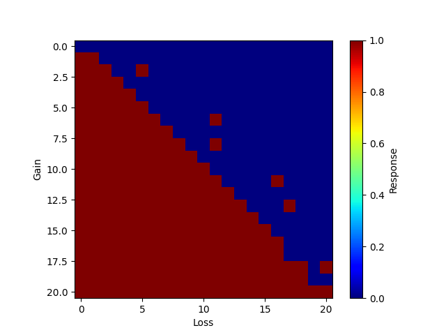

# Report: outputs/test2/test-test2_task-mixedgamble_model-70b_taskstring-40gain40loss_hash-Mew2h8Zl
## Config

### task

    - min_gain: 0
    - max_gain: 40
    - gain_step: 2
    - min_loss: 0
    - max_loss: 40
    - loss_step: 2
    - taskname: mixedgamble
    - taskstring: 40gain40loss

### model

    - model: togethercomputer/llama-2-70b-chat
    - max_tokens: 1024
    - temperature: 0.25

### prompts

    - system_prompt: You are a human subject in a psychology experiment. 
    - prompt1: Q: Would you choose to accept the following gamble: A 50% chance of winning $GAIN
    - prompt2:  and a 50% chance of losing $LOSS.  Please respond with 'yes' or 'no'
    - start: You have $100 in your pocket. 

## Estimated prospect theory parameters:

    - loss aversion(lambda): 0.953
    - curvature (rho): 0.880
    - inverse temperature (mu): 2.000
    - proportion of correctly predicted responses: 0.9773                    
## Response matrix

## Mean gain

## Mean loss

